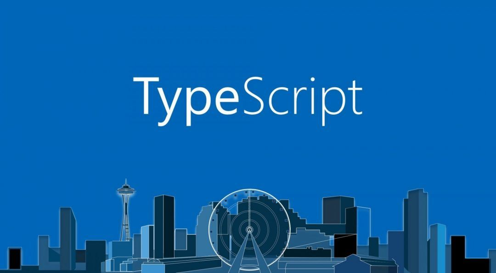

<!-- WIP -->

<h1 align="center">Projeto Typescript - Trybesmith</h1>

 
  

  

<!-- TABLE OF CONTENTS -->
<h2 id="table-of-contents"> :book: Tabela de Conteúdos</h2>

  
Tabela de conteúdos

  <ol>
    <li><a href="#sobre"> ➤ Sobre o projeto</a></li>
    <li><a href="#tecnologias"> ➤ Tecnologias utilizadas</a></li>
    <li><a href="#descrição-do-projeto"> ➤ Descrição do projeto</a></li>
    <li><a href="#instruções"> ➤ Instruções</a></li>
    <li><a href="#requisitos"> ➤ Requisitos realizados </a></li>
    <li><a href="#requisito1"> ➤ Requisito 1:  </a></li>
    <li><a href="#requisito2"> ➤ Requisito 2:  </a></li>
    <li><a href="#requisito3"> ➤ Requisito 3:  </a></li>
    <li><a href="#requisito4"> ➤ Requisito 4:  </a></li>
    <li><a href="#requisito5"> ➤ Requisito 5:  </a></li>
    <li><a href="#requisito6"> ➤ Requisito 6:  </a></li>
    <li><a href="#requisito7"> ➤ Requisito 7:  </a></li>
    <li><a href="#requisito8"> ➤ Requisito 8:  </a></li>
    <li><a href="#requisito9"> ➤ Requisito 9:  </a></li>
    <li><a href="#requisito10"> ➤ Requisito 10:  </a></li>
    <li><a href="#requisito11"> ➤ Requisito 11:  </a></li>
    <li><a href="#requisito12"> ➤ Requisito 12:  </a></li>
    <li><a href="#requisito13"> ➤ Requisito 13:  </a></li>
    <li><a href="#requisito14"> ➤ Requisito 14:  </a></li>
    <li><a href="#requisito15"> ➤ Requisito 15:  </a></li>
    <li><a href="#requisito16"> ➤ Requisito 16:  </a></li>
    <li><a href="#requisito17"> ➤ Requisito 17:  </a></li>
    <li><a href="#requisito18"> ➤ Requisito 18:  </a></li>
    <li><a href="#requisito19"> ➤ Requisito 19:  </a></li>
    <li><a href="#requisito20"> ➤ Requisito 20:  </a></li>
    <li><a href="#créditos"> ➤ Créditos </a></li>
  </ol>

  

<h2 id="sobre"> :pencil: Sobre o projeto </h2>

  
Projeto desenvolvido durante a formação de BackEnd na Trybe com o intuito de consolidar o início do aprendizado de P.O.O. e Typescript, utlizando padrões arquiteturais MSC e REST.

  

<h2 id="tecnologias"> :computer: Tecnologias utilizadas</h2>

  
  
  
  
   
  
  
   
  
  
  
  

  

<h2 id="descrição-do-projeto"> :page_facing_up: Descrição</h2>

  
Descrição
 
  Tem-se um arquivo (``) que foi utilizado como base para fazer  .  
  
  Neste projeto eu realizei:
  
  <ol>
    <li></li>
    <li></li>
    <li></li>
    <li></li>
  </ol> 

  Durante o desenvolvimento foi utilizado Docker.   

  

<h2 id="instruções"> :scroll: Instruções</h2>

1. Clone o repositório
  * `git clone git@github.com:Gabrielle-Murat/Typescript-Trybesmith.git`
  * Entre na pasta do repositório que você acabou de clonar;
 

2. Instale as dependências:
  * `npm install`
 
  
3. Para iniciar o servidor em modo de desenvolvimento:
  * Execute o comando: `npm run dev`
 
    

  

<h2 id="requisitos"> :woman_technologist: Requisitos Realizados:</h2>

  
Criação de :

  <h4 id="requisito1">Requisito 1: Criação </h4>
  
    1. Criar um :
      1.1. 
      1.2. 

  <h4 id="requisito2">Requisito 2: Criação </h4>
  
    2. Criar um :
      2.1. 
      2.2. 

  <h4 id="requisito3">Requisito 3: Criação </h4>
  
    3. Criar um :
      3.1. 
      3.2. 
      3.3. 
      3.4. 

  <h4 id="requisito4">Requisito 4: Criação </h4>
  
    4. Validar :
      4.1. 
      4.2. 
      4.3. 

  <h4 id="requisito5">Requisito 5: Criação </h4>
  
    5. Criar um :
      5.1. 
      5.2. 
      5.3. 
      5.4. 
      5.5. 
      5.6. 
      5.7. 
      5.8. 
      5.9. 
      5.10. 

  <h4 id="requisito6">Requisito 6: Criação </h4>
  
    6. Criar um :
      6.1. 
      6.2. 
      6.3. 
      6.4. 
      6.5. 

  <h4 id="requisito7">Requisito 7: Criação </h4>
  
    7. Criar um :
      7.1. 
      7.2. 
      7.3. 

  <h4 id="requisito8">Requisito 8: Criação </h4>
  
    8. Criar em :
      8.1. 
      8.2. 
      8.3. 
      8.4. 
      8.5. 

  <h4 id="requisito9">Requisito 9: Criação </h4>
  
    9. 

  <h4 id="requisito10">Requisito 10: </h4>
  
    10. 

  <h4 id="requisito11">Requisito 11: </h4>
  
    11. 
  
  <h4 id="requisito12">Requisito 12: </h4>
  
    12. 
  
  <h4 id="requisito13">Requisito 13: </h4>
  
    13. 
  
  <h4 id="requisito14">Requisito 14: </h4>
  
    14. 
  
  <h4 id="requisito15">Requisito 15: </h4>
  
    15. 

  <h4 id="requisito16">Requisito 16: </h4>
  
    16. 

  <h4 id="requisito17">Requisito 17: </h4>
  
    17. 
  
  <h4 id="requisito18">Requisito 18: </h4>
  
    18. 
  
  <h4 id="requisito19">Requisito 19: </h4>
  
    19. 

 

  

  <h4 id="requisito20">Requisito 20: </h4>
  
    20. 

 

  

<h2 id="créditos"> 💳 Créditos</h2>

Arquivo de  ( ) e docker compose (docker-compose.yml) fornecidos pela Trybe.

